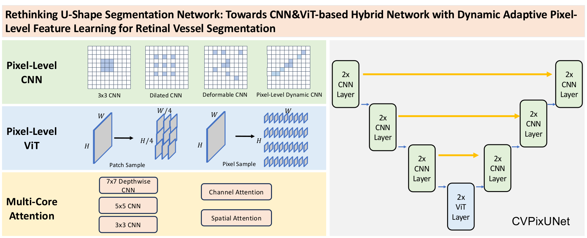
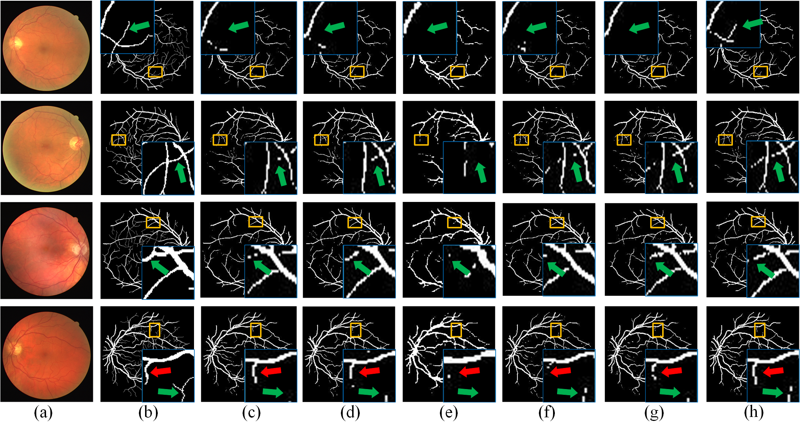
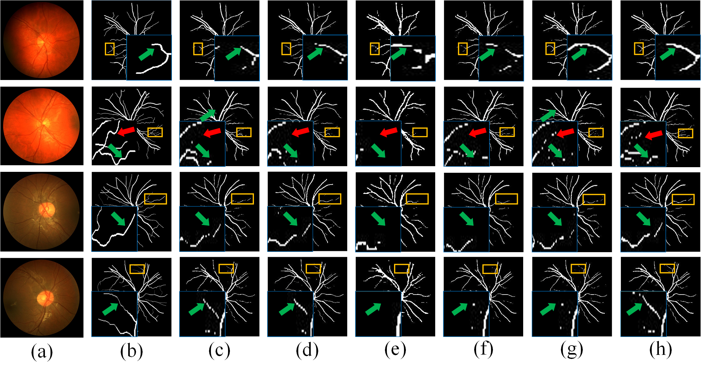

# CVPixUNet
Rethinking U-Shape Segmentation Network: Towards CNN- \&amp; ViT-based Hybrid Network with Dynamic Adaptive Pixel-Level Feature Learning for Retinal Vessel Segmentation

(Under Review)


## Motivation

Exploring Pixel-Level DynamiC CNN + Pixel-Level ViT for medical image segmentation.

## Requirements
* Pytorch
* Some basic python packages such as Numpy, Scikit-image, SimpleITK, Scipy ......


## DataSets
DRIVE
CHASEDB1

## Results
Segmentation Visualization of DRIVE Dataset Including: (a) Original Image; (b) Ground Truth (c) UNet  (d) UNet++ (e) DeepLabv3++ (f) ConvUNext (g) DSCNet and (h) CVPixUNet.


Segmentation Visualization of CHASEDB1 dataset, where (a) Original image (b) Ground truth  (c) UNet (d) UNet++ (e) DeepLabv3+ (f) ConvUNeXt (g)DSCNet and (h) CVPixUNet



## Usage

1. Clone the repo:
```
git clone https://github.com/ziyangwang007/CVPixUNet.git
cd CVPixUNet
```

2. Train the model

```
python train.py 
```

3. Test the model
```
python val.py 
```

## Reference

Under Review
